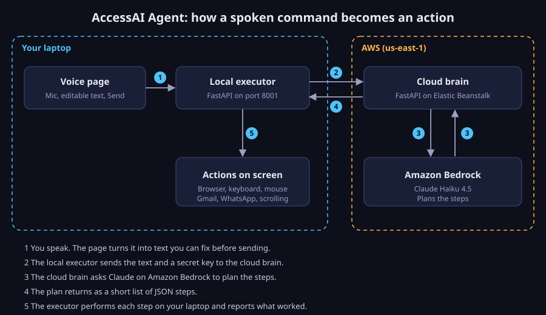

# AccessAI Agent

**One voice. Full control. For everyone.**

AccessAI Agent lets people with motor disabilities, and anyone who wants to work hands-free, run their laptop by speaking. You say what you want, Claude on Amazon Bedrock plans the steps, and your laptop carries them out: opening sites, scrolling, sending email, messaging on WhatsApp.

**Live URL:** http://accessai-brain.us-east-1.elasticbeanstalk.com
(The page shows the product. The planning endpoint behind it is protected by a secret key so it cannot be used by strangers. Health check: `/health`.)

Built for the AWS Zero to Shipped hackathon. Category: Social Good (Health). Team: Mind Flayer.

## Why this exists

Most voice tools handle one command at a time, like "open Gmail". People who cannot use a mouse or keyboard need whole tasks done: "send Maryam a WhatsApp message saying I'm running late". AccessAI turns a spoken sentence into a complete multi-step task, and lets you correct a misheard word before anything runs.

## How it works



- **Voice page (`app.html`)**: click the mic, speak, click again to stop. The text stays editable so a misheard name never reaches your apps. Served from the local executor at `http://localhost:8001/`.
- **Local executor (`local_executor.py`)**: runs on the user's own laptop, because only the laptop can move its own mouse and keyboard. It asks the cloud brain for a plan, then runs each step (browser, keyboard, Windows UI Automation).
- **Cloud brain (`cloud_brain.py`)**: runs on AWS Elastic Beanstalk. It calls Claude Haiku 4.5 on Amazon Bedrock and returns only a JSON list of steps. It never touches a screen.

Splitting thinking (cloud) from acting (laptop) keeps the AI on AWS while your computer stays in your control.

## What works today

- Open any website by name and scroll it.
- Send a Gmail message by voice, with the Send button clicked and checked.
- Send a WhatsApp Web message by contact name. Partial names work ("Maryam" finds "Maryam Januu") because WhatsApp's own search does the matching.
- Dark interface, designed to be easy on the eyes.

Windows only for now.

## AWS services used

- **Amazon Bedrock**: Claude Haiku 4.5 plans each task.
- **AWS Elastic Beanstalk**: hosts the cloud brain at the live URL.
- **AWS IAM**: the server uses an instance role with Bedrock access, so no keys are stored on it.
- **Kiro with the Agent Toolkit for AWS**: used to build and ship the project.

## Run it yourself

You need Windows, Python 3.11 or newer, Edge or Chrome, and an AWS account with Bedrock access to Claude Haiku 4.5 in us-east-1 (set up with `aws configure`).

```powershell
git clone https://github.com/AreebaGhaffar/accessai-agent
cd accessai-agent
python -m venv .venv
.venv\Scripts\pip install fastapi uvicorn boto3 httpx pyautogui pyperclip pillow pydantic
```

Terminal 1, the brain:

```powershell
.venv\Scripts\python.exe -m uvicorn cloud_brain:app --port 8000
```

Terminal 2, the executor:

```powershell
$env:CLOUD_BRAIN_URL="http://localhost:8000"
.venv\Scripts\python.exe -m uvicorn local_executor:app --port 8001
```

Open `http://localhost:8001/`, click the mic and speak. For WhatsApp, be signed in to WhatsApp Web in your browser first.

To point the executor at a deployed brain that uses an API key, also set `$env:BRAIN_API_KEY` to the same value as the server's `BRAIN_API_KEY` setting.

## Safety and limits

- The cloud endpoint requires a secret key. No key is stored in this repository.
- Today the agent runs the plan as soon as you press Send. Confirmation before risky actions (send, delete, pay) is the next safety feature.
- Speech recognition uses the browser's built-in service, which can mishear names. That is why the text is editable before sending.

## Roadmap

1. See-and-act loop: the laptop shares a screenshot, Claude picks the next single action, and it repeats until the task is done, so it works on apps we never wrote code for.
2. Pause one task, start another, resume the first.
3. Wake word and spoken replies for a fully hands-free feel.
4. Amazon Transcribe for more accurate speech recognition across accents.
5. Confirmation prompts before risky actions.

## Team

Mind Flayer. Builder: Areeba Ghaffar.
